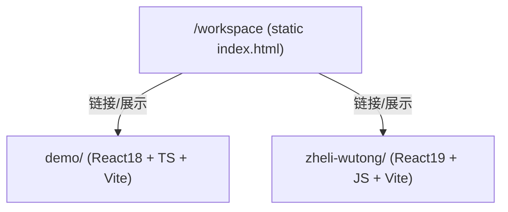
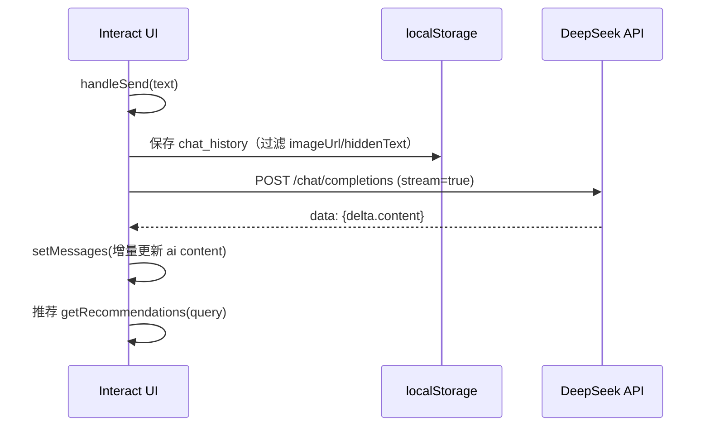
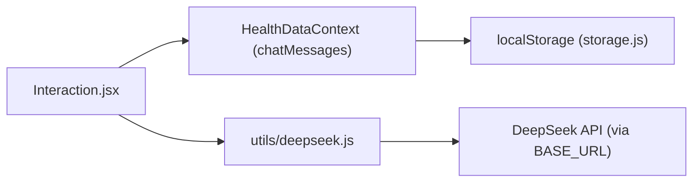

# 02. 架构与核心流程

## 总体架构（仓库级）

该仓库不是一个“单体应用”，而是：

- 1 个根目录静态页面（宣传/演示用途）
- 2 个互相独立的 Vite + React 前端工程

## 分层（子项目通用）

两个子项目在代码组织上都采用类似分层：

- Entry：`main.(t|j)sx` 挂载 React Root
- Router：`App.(t|j)sx` 定义路由与页面入口
- Layout：页面壳（导航、Outlet）
- Pages：各路由页面（承载业务流程）
- Data/Utils：本地数据、算法、API 封装与工具函数
- Persistence：localStorage（demo 是页面级写入，zheli-wutong 是集中封装与全局状态）

## 关键流程 A：文字对话（DeepSeek 流式）

### demo：页面内直接实现

入口页面： [Interact](file:///workspace/demo/src/pages/Interact.tsx)

核心行为：

- 用户输入文本 → `handleSend()` 创建 user msg + 占位 ai msg → `fetchAIResponse()`
- `fetchAIResponse()` 将历史消息组织为 DeepSeek messages，并以 `stream: true` 发起请求
- 通过 `ReadableStream.getReader()` + `TextDecoder` 按行解析 `data: {json}`，增量拼接到 ai msg

关键实现位置：

- 构造 history： [Interact.tsx:L146-L151](file:///workspace/demo/src/pages/Interact.tsx#L146-L151)
- 流式解析： [Interact.tsx:L192-L229](file:///workspace/demo/src/pages/Interact.tsx#L192-L229)

### zheli-wutong：集中封装 + 全局 chat 状态

入口页面： [Interaction](file:///workspace/zheli-wutong/src/pages/Interaction.jsx)

核心行为：

- 用户输入 → `dispatch(ADD_CHAT_MESSAGE)` 写入全局 chatMessages（[HealthDataContext](file:///workspace/zheli-wutong/src/context/HealthDataContext.jsx#L83-L99)）
- `callAI()` 构建 `chatHistory`（过滤图片消息）→ 调 `healthChatStream()`（[deepseek.js](file:///workspace/zheli-wutong/src/utils/deepseek.js#L176-L223)）
- `healthChatStream()` 内部调用 `chatCompletionStream()` 统一处理流式协议

## 关键流程 B：图片 → OCR → AI 解读

### demo：图片作为 UI 可见消息，OCR 文本作为 hiddenText 仅发给 AI

入口： [Interact.handleImageUpload](file:///workspace/demo/src/pages/Interact.tsx#L86-L142)

- 上传图片后先生成本地 `imageUrl` 用于聊天展示
- OCR 结果做清理（去空行），拼成 `hiddenText`
- `hiddenText` 参与 DeepSeek messages 的构造，但 UI 展示为“这是一份检查报告图片”
- 为避免 localStorage 爆炸：保存时会剥离 `imageUrl` 与 `hiddenText` 并标记 `isImagePlaceholder`

关键实现位置：

- OCR： [Interact.tsx:L94-L127](file:///workspace/demo/src/pages/Interact.tsx#L94-L127)
- localStorage 清理： [Interact.tsx:L70-L84](file:///workspace/demo/src/pages/Interact.tsx#L70-L84)

### zheli-wutong：图片消息保留为 base64，另行 OCR 后将文字发送给 AI

入口： [Interaction.handleImageUpload](file:///workspace/zheli-wutong/src/pages/Interaction.jsx#L366-L467)

- 先把图片作为 `type: image` 消息写入全局聊天（用于预览）
- 使用 Tesseract OCR 获取文字，构造提示词（包含 OCR 文本）
- 使用 `healthChatStream()` 流式生成回复，最终写回 chatMessages

## 关键流程 C：健康画像/体重数据与派生指标

zheli-wutong 的“数据层”核心是 [HealthDataContext](file:///workspace/zheli-wutong/src/context/HealthDataContext.jsx#L1-L219)：

- 原始数据：
  - `profile`（basicInfo/medicalReport/lifestyle/chronicDiseases/deviceData）
  - `weightRecords`（记录）
  - `weightGoal`（目标）
  - `chatMessages`（对话）
- 持久化：
  - `getStorage()/setStorage()`（[storage.js](file:///workspace/zheli-wutong/src/utils/storage.js#L1-L33)）
  - 多个 `useEffect` 分别写入不同 key（profile/weightRecords/chat/goal）
- 派生指标（useMemo）：
  - BMI：`calculateBMI`（[healthCalc.js](file:///workspace/zheli-wutong/src/utils/healthCalc.js#L7-L21)）
  - healthScore：`calculateHealthScore`（[healthCalc.js](file:///workspace/zheli-wutong/src/utils/healthCalc.js#L27-L86)）
  - weightTrend/weightStats/weightAlerts：同文件不同函数段

